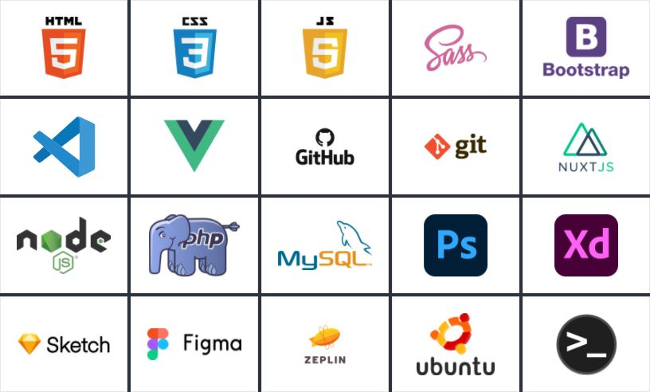

```js

```


```js
const app = new Vue({
	el: '#app',
	name: "About me",
	data: {
		name: 'Ferdi Tarakcı',
		title: 'Web Developer',
		age: 36,
		city: 'İstanbul',
		company: 'Digidea',
		jobTitle: 'Front-End Developer'
	}
});
```

### Technologies and Tools I Use

