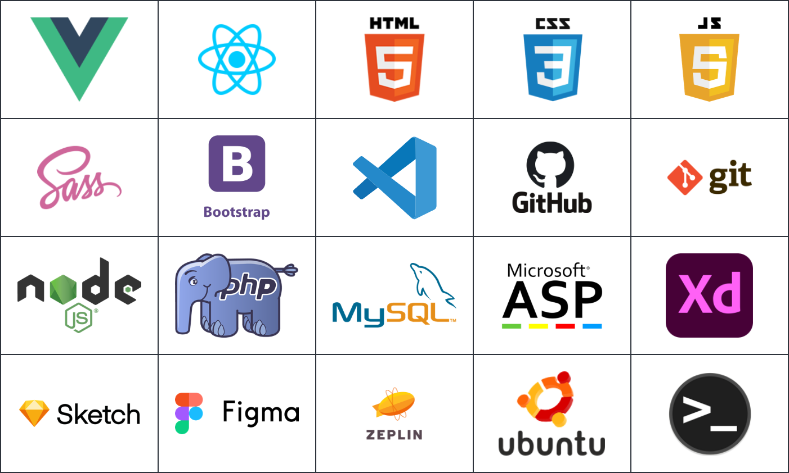

```js

```


```js
import { createApp } from 'vue'

const app = createApp({
  name: "About me",
  data() {
    return {
      name: 'Ferdi Tarakcı',
      title: 'Web Developer',
      jobTitle: 'Front-End Developer'
      age: 37,
      city: 'İstanbul',
      company: 'Digidea',
    }
  }
});

app.mount('#app');
```

### Technologies and Tools I Use

