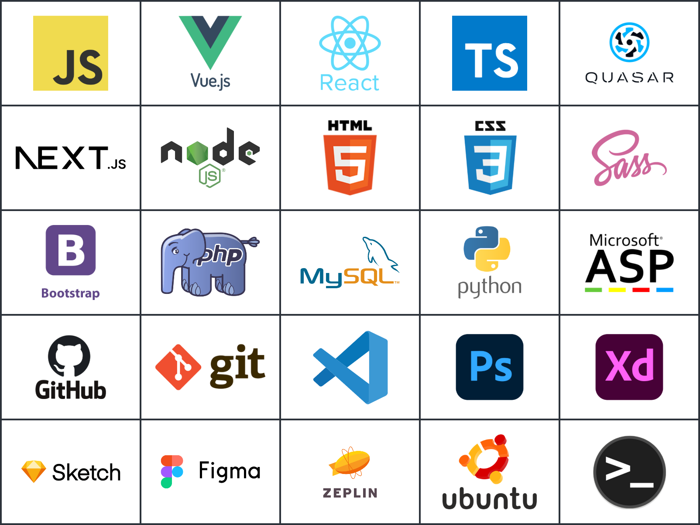

```js

```


```js
import { createApp } from 'vue'

const app = createApp({
  name: 'About me',
  data() {
    return {
      name: 'Ferdi Tarakci',
      title: 'Software Developer',
      jobTitle: 'Front-End Web Developer',
      company: 'TransferChain',
      city: 'Istanbul',
    }
  }
});

app.mount('#app');
```

### Technologies and Tools I Use

